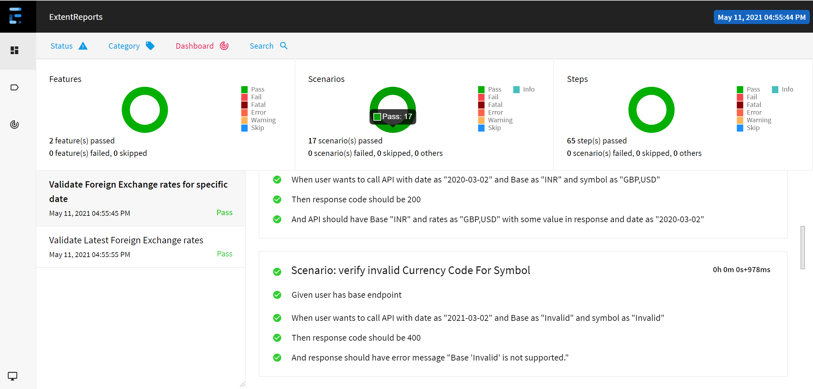

# Assignment
    The Automation test framework developed for https://ratesapi.io/documentation/. 
    
# Tech stack:
  1. Programming language: Java
  2. Build management tool: Maven
  3. Unit Testing Framework: JUnit
  4. BDD framework: cucumber
  5. Reporting framework: Extent Report
  6. CICD: github Actions
  
  
  # Test Report Screenshot:
  
  
  # How to Run Tests
   mvn test -Dcucumber.options="--tags @regression"
